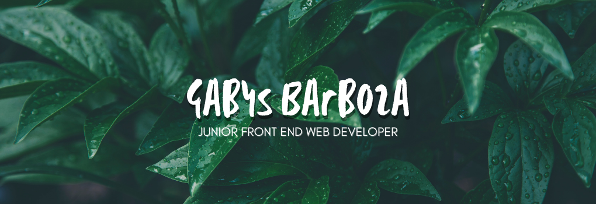

<h2 align=center>Hi, i'm Gabys!

</h2>
 

 
 

<h2 align=center>About me

</h2>
 

<i>Things that I'm in love with... </i>❤️

🐾 Animals (including snakes)... 
📚 Books (of course!)... 
🏀 Sports (i'm pole dancer and a gym rat)... 
✈️ Travel (one day i'll be living in German)... 
🎧 Music (metal sucks!)... 
🌴 Nature (did you see the banner?)... 
👾 Videogames...

 
<h2 align=center>About my skills

</h2>

<i>Things that I know...</i>🌞

 

<i>Things that I'm learning...</i>👷

